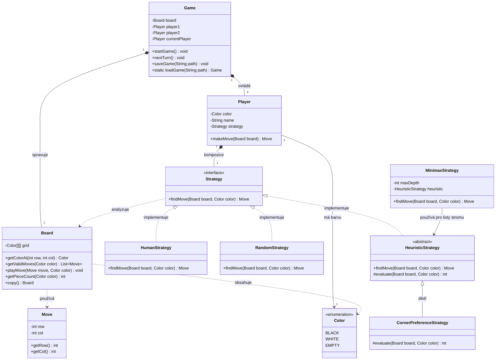

```mermaid
classDiagram
    %% --- JÁDRO HRY (LOGIKA) ---
    class Board {
        -Color[][] grid
        +getColorAt(int row, int col) Color
        +getValidMoves(Color color) List~Move~
        +playMove(Move move, Color color) void
        +getPieceCount(Color color) int
        +copy() Board
    }

    class Move {
        -int row
        -int col
        +getRow() int
        +getCol() int
    }

    class Color {
        <<enumeration>>
        BLACK
        WHITE
        EMPTY
    }

    %% --- STRATEGIE A AI ---
    class Strategy {
        <<interface>>
        +findMove(Board board, Color color) Move
    }

    class HumanStrategy {
        +findMove(Board board, Color color) Move
    }

    class RandomStrategy {
        +findMove(Board board, Color color) Move
    }

    class HeuristicStrategy {
        <<abstract>>
        +findMove(Board board, Color color) Move
        #evaluate(Board board, Color color) int
    }

    class MinimaxStrategy {
        -int maxDepth
        -HeuristicStrategy heuristic
        +findMove(Board board, Color color) Move
    }

    class CornerPreferenceStrategy {
        #evaluate(Board board, Color color) int
    }

    %% --- ŘÍZENÍ A HRÁČ ---
    class Player {
        -Color color
        -String name
        -Strategy strategy
        +makeMove(Board board) Move
    }

    class Game {
        -Board board
        -Player player1
        -Player player2
        -Player currentPlayer
        +startGame() void
        +nextTurn() void
        +saveGame(String path) void
        +static loadGame(String path) Game
    }

    %% --- VZTAHY ---
    Strategy <|.. HumanStrategy : implementuje
    Strategy <|.. RandomStrategy : implementuje
    Strategy <|.. HeuristicStrategy : implementuje
    HeuristicStrategy <|-- CornerPreferenceStrategy : dědí
    
    MinimaxStrategy --> HeuristicStrategy : používá pro listy stromu
    
    Player "1" *-- "1" Strategy : kompozice
    Player "1" --> "1" Color : má barvu
    
    Game "1" *-- "1" Board : spravuje
    Game "1" *-- "2" Player : ovládá
    
    Board ..> Move : používá
    Board ..> Color : obsahuje
    Strategy ..> Board : analyzuje
```