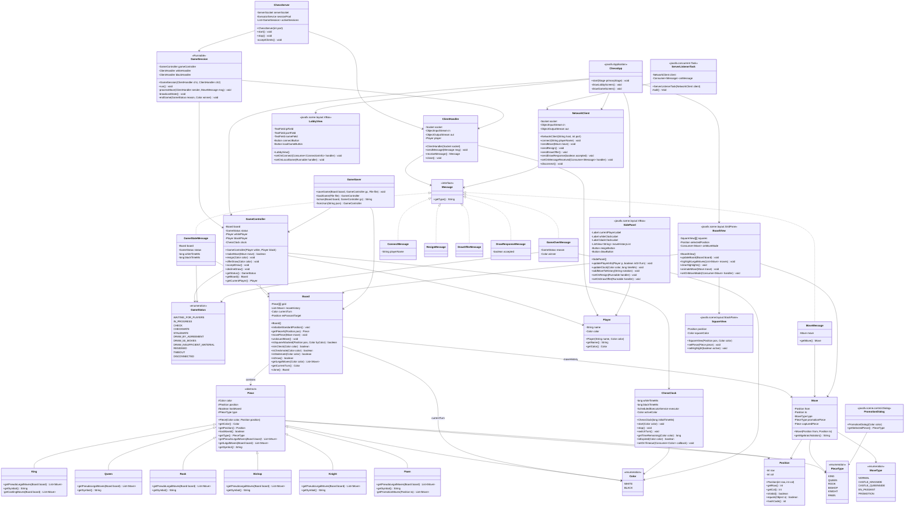

# Objektový návrh – Class Diagram

```mermaid
classDiagram
    direction TB

    %% ===== ENUMS =====
    class Color {
        <<enumeration>>
        WHITE
        BLACK
    }

    class MoveType {
        <<enumeration>>
        NORMAL
        CASTLE_KINGSIDE
        CASTLE_QUEENSIDE
        EN_PASSANT
        PROMOTION
    }

    class GameStatus {
        <<enumeration>>
        WAITING_FOR_PLAYERS
        IN_PROGRESS
        CHECK
        CHECKMATE
        STALEMATE
        DRAW_BY_AGREEMENT
        DRAW_50_MOVES
        DRAW_INSUFFICIENT_MATERIAL
        RESIGNED
        TIMEOUT
        DISCONNECTED
    }

    class PieceType {
        <<enumeration>>
        KING
        QUEEN
        ROOK
        BISHOP
        KNIGHT
        PAWN
    }

    %% ===== MODEL – Core =====
    class Position {
        -int row
        -int col
        +Position(int row, int col)
        +getRow() int
        +getCol() int
        +isValid() boolean
        +equals(Object o) boolean
        +hashCode() int
    }

    class Move {
        -Position from
        -Position to
        -MoveType type
        -PieceType promotionPiece
        -Piece capturedPiece
        +Move(Position from, Position to)
        +getAlgebraicNotation() String
    }

    class Board {
        -Piece[][] grid
        -List~Move~ moveHistory
        -Color currentTurn
        -Position enPassantTarget
        +Board()
        +initializeStandardPosition() void
        +getPieceAt(Position pos) Piece
        +movePiece(Move move) void
        +undoLastMove() void
        +isSquareAttacked(Position pos, Color byColor) boolean
        +isInCheck(Color color) boolean
        +isCheckmate(Color color) boolean
        +isStalemate(Color color) boolean
        +isDraw() boolean
        +getLegalMoves(Color color) List~Move~
        +getCurrentTurn() Color
        +clone() Board
    }

    %% ===== MODEL – Pieces =====
    class Piece {
        <<abstract>>
        #Color color
        #Position position
        #boolean hasMoved
        #PieceType type
        +Piece(Color color, Position position)
        +getColor() Color
        +getPosition() Position
        +hasMoved() boolean
        +getType() PieceType
        +getPseudoLegalMoves(Board board)* List~Move~
        +getLegalMoves(Board board) List~Move~
        +getSymbol()* String
    }

    class King {
        +getPseudoLegalMoves(Board board) List~Move~
        +getSymbol() String
        -getCastlingMoves(Board board) List~Move~
    }

    class Queen {
        +getPseudoLegalMoves(Board board) List~Move~
        +getSymbol() String
    }

    class Rook {
        +getPseudoLegalMoves(Board board) List~Move~
        +getSymbol() String
    }

    class Bishop {
        +getPseudoLegalMoves(Board board) List~Move~
        +getSymbol() String
    }

    class Knight {
        +getPseudoLegalMoves(Board board) List~Move~
        +getSymbol() String
    }

    class Pawn {
        +getPseudoLegalMoves(Board board) List~Move~
        +getSymbol() String
        -getPromotionMoves(Position to) List~Move~
    }

    %% ===== MODEL – Game =====
    class GameController {
        -Board board
        -GameStatus status
        -Player whitePlayer
        -Player blackPlayer
        -ChessClock clock
        +GameController(Player white, Player black)
        +makeMove(Move move) boolean
        +resign(Color color) void
        +offerDraw(Color color) void
        +acceptDraw() void
        +declineDraw() void
        +getStatus() GameStatus
        +getBoard() Board
        +getCurrentPlayer() Player
    }

    class Player {
        -String name
        -Color color
        +Player(String name, Color color)
        +getName() String
        +getColor() Color
    }

    class ChessClock {
        -long whiteTimeMs
        -long blackTimeMs
        -ScheduledExecutorService executor
        -Color activeColor
        +ChessClock(long initialTimeMs)
        +start(Color color) void
        +stop() void
        +switchTurn() void
        +getTimeRemaining(Color color) long
        +isExpired(Color color) boolean
        +setOnTimeout(Consumer~Color~ callback) void
    }

    %% ===== NETWORK – Messages =====
    class Message {
        <<interface>>
        +getType() String
    }

    class MoveMessage {
        -Move move
        +getMove() Move
    }

    class GameStateMessage {
        -Board board
        -GameStatus status
        -long whiteTimeMs
        -long blackTimeMs
    }

    class GameOverMessage {
        -GameStatus reason
        -Color winner
    }

    class ConnectMessage {
        -String playerName
    }

    class ResignMessage
    class DrawOfferMessage
    class DrawResponseMessage {
        -boolean accepted
    }

    %% ===== NETWORK – Server =====
    class ChessServer {
        -ServerSocket serverSocket
        -ExecutorService sessionPool
        -List~GameSession~ activeSessions
        +ChessServer(int port)
        +start() void
        +stop() void
        -acceptClients() void
    }

    class GameSession {
        <<Runnable>>
        -GameController gameController
        -ClientHandler whiteHandler
        -ClientHandler blackHandler
        +GameSession(ClientHandler ch1, ClientHandler ch2)
        +run() void
        -processMove(ClientHandler sender, MoveMessage msg) void
        -broadcastState() void
        -endGame(GameStatus reason, Color winner) void
    }

    class ClientHandler {
        -Socket socket
        -ObjectInputStream in
        -ObjectOutputStream out
        -Player player
        +ClientHandler(Socket socket)
        +sendMessage(Message msg) void
        +receiveMessage() Message
        +close() void
    }

    %% ===== NETWORK – Client =====
    class NetworkClient {
        -Socket socket
        -ObjectInputStream in
        -ObjectOutputStream out
        +NetworkClient(String host, int port)
        +connect(String playerName) void
        +sendMove(Move move) void
        +sendResign() void
        +sendDrawOffer() void
        +sendDrawResponse(boolean accepted) void
        +setOnMessageReceived(Consumer~Message~ handler) void
        +disconnect() void
    }

    class ServerListenerTask {
        <<javafx.concurrent.Task>>
        -NetworkClient client
        -Consumer~Message~ onMessage
        +ServerListenerTask(NetworkClient client)
        #call() Void
    }

    %% ===== GUI =====
    class ChessApp {
        <<javafx.Application>>
        +start(Stage primaryStage) void
        -showLobbyScreen() void
        -showGameScreen() void
    }

    class BoardView {
        <<javafx.scene.layout.GridPane>>
        -SquareView[][] squares
        -Position selectedPosition
        -Consumer~Move~ onMoveMade
        +BoardView()
        +updateBoard(Board board) void
        +highlightLegalMoves(List~Move~ moves) void
        +clearHighlights() void
        +animateMove(Move move) void
        +setOnMoveMade(Consumer~Move~ handler) void
    }

    class SquareView {
        <<javafx.scene.layout.StackPane>>
        -Position position
        -Color squareColor
        +SquareView(Position pos, Color color)
        +setPiece(Piece piece) void
        +setHighlight(boolean active) void
    }

    class SidePanel {
        <<javafx.scene.layout.VBox>>
        -Label currentPlayerLabel
        -Label whiteClockLabel
        -Label blackClockLabel
        -ListView~String~ moveHistoryList
        -Button resignButton
        -Button drawButton
        +SidePanel()
        +updatePlayerInfo(Player p, boolean isOnTurn) void
        +updateClock(Color color, long timeMs) void
        +addMoveToHistory(String notation) void
        +setOnResign(Runnable handler) void
        +setOnDrawOffer(Runnable handler) void
    }

    class PromotionDialog {
        <<javafx.scene.control.Dialog>>
        +PromotionDialog(Color color)
        +getSelectedPiece() PieceType
    }

    class LobbyView {
        <<javafx.scene.layout.VBox>>
        -TextField ipField
        -TextField portField
        -TextField nameField
        -Button connectButton
        -Button localGameButton
        +LobbyView()
        +setOnConnect(Consumer~ConnectionInfo~ handler) void
        +setOnLocalGame(Runnable handler) void
    }

    %% ===== PERSISTENCE =====
    class GameSaver {
        +saveGame(Board board, GameController gc, File file) void
        +loadGame(File file) GameController
        -toJson(Board board, GameController gc) String
        -fromJson(String json) GameController
    }

    %% ===== RELATIONSHIPS =====
    Piece <|-- King
    Piece <|-- Queen
    Piece <|-- Rook
    Piece <|-- Bishop
    Piece <|-- Knight
    Piece <|-- Pawn

    Piece --> Color
    Piece --> Position
    Piece --> PieceType

    Move --> Position
    Move --> MoveType
    Move --> PieceType

    Board --> Piece : contains
    Board --> Move : moveHistory
    Board --> Color : currentTurn

    GameController --> Board
    GameController --> Player
    GameController --> ChessClock
    GameController --> GameStatus

    ChessClock --> Color

    Message <|.. MoveMessage
    Message <|.. GameStateMessage
    Message <|.. GameOverMessage
    Message <|.. ConnectMessage
    Message <|.. ResignMessage
    Message <|.. DrawOfferMessage
    Message <|.. DrawResponseMessage

    MoveMessage --> Move
    GameStateMessage --> Board
    GameStateMessage --> GameStatus
    GameOverMessage --> GameStatus
    GameOverMessage --> Color

    ChessServer --> GameSession
    ChessServer --> ClientHandler

    GameSession --> GameController
    GameSession --> ClientHandler

    ClientHandler --> Player
    ClientHandler --> Message

    NetworkClient --> Message

    ServerListenerTask --> NetworkClient

    ChessApp --> LobbyView
    ChessApp --> BoardView
    ChessApp --> SidePanel
    ChessApp --> NetworkClient
    ChessApp --> GameController

    BoardView --> SquareView
    BoardView --> Board
    BoardView --> Move

    SidePanel --> Player

    PromotionDialog --> PieceType

    GameSaver --> Board
    GameSaver --> GameController
```
