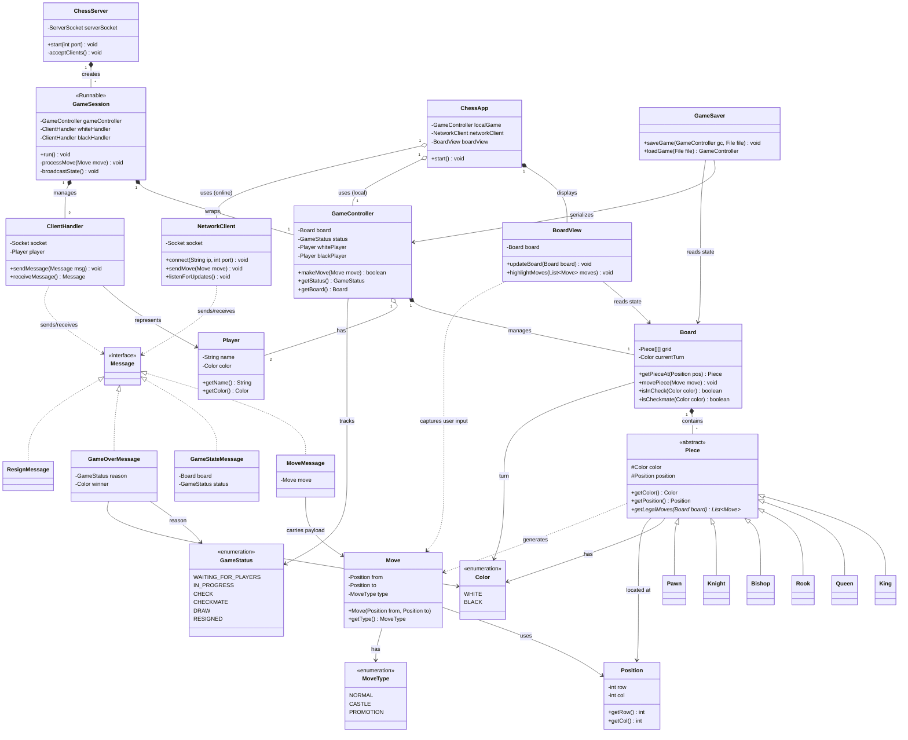

```mermaid

classDiagram
    direction TB

    %% ===== ENUMS =====
    class Color {
        <<enumeration>>
        WHITE
        BLACK
    }

    class GameStatus {
        <<enumeration>>
        WAITING_FOR_PLAYERS
        IN_PROGRESS
        CHECK
        CHECKMATE
        DRAW
        RESIGNED
    }

    class MoveType {
        <<enumeration>>
        NORMAL
        CASTLE
        PROMOTION
    }

    %% ===== BASIC DATA =====
    class Position {
        -int row
        -int col
        +getRow() int
        +getCol() int
    }

    class Move {
        -Position from
        -Position to
        -MoveType type
        +Move(Position from, Position to)
        +getType() MoveType
    }

    class Player {
        -String name
        -Color color
        +getName() String
        +getColor() Color
    }

    %% ===== GAME LOGIC =====
    class Board {
        -Piece[][] grid
        -Color currentTurn
        +getPieceAt(Position pos) Piece
        +movePiece(Move move) void
        +isInCheck(Color color) boolean
        +isCheckmate(Color color) boolean
    }

    class GameController {
        -Board board
        -GameStatus status
        -Player whitePlayer
        -Player blackPlayer
        +makeMove(Move move) boolean
        +getStatus() GameStatus
        +getBoard() Board
    }

    %% ===== PIECES =====
    class Piece {
        <<abstract>>
        #Color color
        #Position position
        +getColor() Color
        +getPosition() Position
        +getLegalMoves(Board board)* List~Move~
    }

    class King
    class Queen
    class Rook
    class Bishop
    class Knight
    class Pawn

    %% ===== NETWORK =====
    class ChessServer {
        -ServerSocket serverSocket
        +start(int port) void
        -acceptClients() void
    }

    class GameSession {
        <<Runnable>>
        -GameController gameController
        -ClientHandler whiteHandler
        -ClientHandler blackHandler
        +run() void
        -processMove(Move move) void
        -broadcastState() void
    }

    class ClientHandler {
        -Socket socket
        -Player player
        +sendMessage(Message msg) void
        +receiveMessage() Message
    }

    class NetworkClient {
        -Socket socket
        +connect(String ip, int port) void
        +sendMove(Move move) void
        +listenForUpdates() void
    }

    %% ===== MESSAGES =====
    class Message {
        <<interface>>
    }
    class MoveMessage {
        -Move move
    }
    class GameStateMessage {
        -Board board
        -GameStatus status
    }
    class GameOverMessage {
        -GameStatus reason
        -Color winner
    }
    class ResignMessage

    %% ===== GUI =====
    class ChessApp {
        -GameController localGame
        -NetworkClient networkClient
        -BoardView boardView
        +start() void
    }
    
    class BoardView {
        -Board board
        +updateBoard(Board board) void
        +highlightMoves(List~Move~ moves) void
    }

    %% ===== PERSISTENCE =====
    class GameSaver {
        +saveGame(GameController gc, File file) void
        +loadGame(File file) GameController
    }

    %% ===== RELATIONSHIPS =====
    %% Piece inheritance
    Piece <|-- King
    Piece <|-- Queen
    Piece <|-- Rook
    Piece <|-- Bishop
    Piece <|-- Knight
    Piece <|-- Pawn

    %% Core Logic links
    Board "1" *-- "*" Piece : contains
    GameController "1" *-- "1" Board : manages
    GameController "1" o-- "2" Player : has
    GameController --> GameStatus : tracks
    Board --> Color : turn
    Piece --> Color : has
    Piece --> Position : located at
    Piece ..> Move : generates
    Move --> Position : uses
    Move --> MoveType : has

    %% Network Links
    ChessServer "1" *-- "*" GameSession : creates
    GameSession "1" *-- "1" GameController : wraps
    GameSession "1" *-- "2" ClientHandler : manages
    ClientHandler --> Player : represents
    ClientHandler ..> Message : sends/receives
    NetworkClient ..> Message : sends/receives
    Message <|.. MoveMessage
    Message <|.. GameStateMessage
    Message <|.. GameOverMessage
    Message <|.. ResignMessage
    MoveMessage --> Move : carries payload
    GameOverMessage --> GameStatus : reason
    GameOverMessage --> Color : winner

    %% GUI Links
    ChessApp "1" *-- "1" BoardView : displays
    ChessApp "1" o-- "1" GameController : uses (local)
    ChessApp "1" o-- "1" NetworkClient : uses (online)
    BoardView --> Board : reads state
    BoardView ..> Move : captures user input

    %% Persistence Links
    GameSaver --> GameController : serializes
    GameSaver --> Board : reads state
```